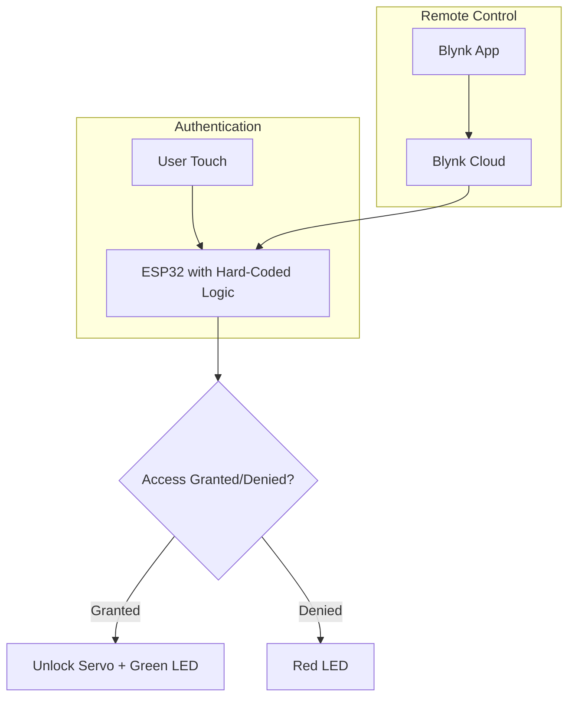

# 🔐 LockAI: IoT Multi-Touch Smart Lock

**LockAI** is an intelligent access control system built on the **ESP32** platform. It uses **multi-finger touch patterns** to create a secure, low-cost smart lock. The system supports remote unlocking and monitoring via the **Blynk mobile app**.

This repository includes not only the firmware for the smart lock but also a complete **data collection and machine learning pipeline**. Python scripts are provided to capture touch patterns, convert them to a CSV dataset, and prepare them for training with services like **Edge Impulse**.

For a live demonstration and detailed project walkthrough, please visit our **[Project Website](https://mrr-buttons.github.io/LockAI/)**.

---

## 🚀 Key Features

*   **Multi-Touch Authentication**: Requires a specific multi-finger touch combination for access.
*   **ML Ready**: Includes firmware to log touch patterns and a Python converter to create ML-ready datasets (`.csv`).
*   **Remote Control**: A **Blynk-powered mobile app** allows for remote unlocking, status monitoring, and configuration.
*   **Rule-Based & ML-Mimicking Logic**: The current implementation uses a hard-coded, rule-based authentication logic derived from a collected dataset. This approach mimics the behavior of a trained ML model, as direct deployment of a `.tflite` model was not feasible due to library and dependency incompatibilities on the ESP32 platform.
*   **Comprehensive Hardware Support**: Designed for the **ESP32** with support for servo motors, capacitive touch sensors, and feedback LEDs.
*   **Complete Data Pipeline**:
    *   `knock_logger.ino`: Captures raw touch sequences and outputs them as JSON.
    *   `serial_data_logger.py`: Reads JSON from the ESP32 and saves it to a `.jsonl` file.
    *   `jsonl_to_csv.py`: Converts the `.jsonl` data into a flattened CSV, perfect for training in Edge Impulse.

---

## 🎯 Use Cases

*   **Personal Secure Storage**: Lockers, drawers, or personal safes.
*   **Workspace & Lab Access**: Secure access to shared equipment or restricted areas.
*   **Academic & Prototyping Projects**: An excellent platform for learning about IoT, TinyML, and embedded systems.
*   **Low-Cost Surveillance**: Log every interaction with a secure container, providing a digital trail of access attempts.

---

## 📦 Tech Stack

| Layer                 | Technology / Platform                               |
| --------------------- | --------------------------------------------------- |
| **Microcontroller**   | ESP32 DevKit v1                                     |
| **Firmware**          | Arduino IDE (C/C++)                                 |
| **Sensors**           | TTP223 Capacitive Touch                             |
| **Actuator**          | SG90 Servo Motor                                    |
| **Mobile App**        | Blynk IoT Platform                                  |
| **Data Logging**      | Python (PySerial)                                   |
| **ML Dataset Prep**   | Python (JSON, CSV)                                  |
| **ML Framework**      | Edge Impulse (for model training)                   |
| **Website**           | React, Vite, GitHub Pages                           |

---

## 🧠 System Architecture

The project operates in two main modes: **Data Collection** and **Smart Lock Operation**.

### 1. Data Collection Workflow

```mermaid
graph TD
    A[User Touch] --> B[ESP32 with knock_logger.ino];
    B --> C[Serial Port (JSON Output)];
    C --> D[Python: serial_data_logger.py];
    D --> E[knock_patterns.jsonl];
    E --> F[Python: jsonl_to_csv.py];
    F --> G[knock_patterns.csv];
    G --> H[ML Training (Edge Impulse)];
```

### 2. Smart Lock Operation Workflow



---

## 🗂️ Repository Structure

```
LockAI/
├── blynk_wifi/                 # Firmware for Blynk-only remote control
├── final_code-no_buzzer/       # Rule-based auth firmware without a buzzer
├── integrated_setup/           # Fully integrated firmware (touch, Blynk)
├── website/                    # Source code for the project's React-based website
├── knock_logger.ino            # ESP32 firmware for data collection
├── sample_code.ino             # Main smart lock firmware with ML and Blynk
├── serial_data_logger.py       # Python script to log serial data to a .jsonl file
├── jsonl_to_csv.py             # Python script to convert .jsonl to a .csv dataset
├── knock_patterns1.csv         # Sample dataset 1
├── knock_patterns2.csv         # Sample dataset 2
└── README.md
```

---

## ⚙️ Setup and Installation

### 1. Hardware Requirements

| Component                  | Quantity | Purpose                                 |
| -------------------------- | :------: | --------------------------------------- |
| ESP32 Dev Board            |    1     | Main microcontroller                    |
| SG90 Servo Motor           |    1     | Locking mechanism                       |
| TTP223 Capacitive Touch Sensor |  3 (or more)  | Multi-finger touch detection            |
| LEDs (Red, Green)          |  1 each  | Access granted/denied feedback          |
| Breadboard & Jumper Wires  |    1     | Prototyping and connections             |

### 2. Software & Configuration

1.  **Arduino IDE**:
    *   Install the **ESP32 board definitions**.
    *   Install the following libraries from the Library Manager:
        *   `ESP32Servo`
        *   `Blynk`

2.  **Python**:
    *   Ensure you have Python 3 installed.
    *   Install the `pyserial` library:
        ```bash
        pip install pyserial
        ```

3.  **Blynk**:
    *   Create a new project in the [Blynk Console](https://blynk.cloud/).
    *   Create a new template and device.
    *   Define datastreams for remote unlocking and status monitoring.
    *   Find your **Blynk Auth Token** to use in the firmware.

---

## 🚀 How to Run the Project

### Step 1: Data Collection (Optional, for custom ML models)

1.  Flash `knock_logger.ino` onto your ESP32.
2.  Connect the ESP32 to your computer via USB.
3.  Modify `serial_data_logger.py` and set the `SERIAL_PORT` to your ESP32's port (e.g., `COM3` on Windows, `/dev/ttyUSB0` on Linux).
4.  Run the logger:
    ```bash
    python serial_data_logger.py
    ```
5.  Perform various touch patterns. The script will save them to `knock_patterns.jsonl`.
6.  Once you have collected enough data, stop the logger (Ctrl+C) and run the converter:
    ```bash
    python jsonl_to_csv.py
    ```
    This will generate `knock_patterns.csv`, which you can upload to Edge Impulse for training.

### Step 2: Deploying the Smart Lock

1.  Open the `integrated_setup/integrated_setup.ino` file in the Arduino IDE.
2.  Update the following credential placeholders with your own:
    *   `auth[]`: Your Blynk Auth Token.
    *   `ssid[]`: Your WiFi network name.
    *   `pass[]`: Your WiFi password.
3.  Flash the firmware to your ESP32. The lock is now operational.

---

## 🌱 Future Scope

*   **Multi-User Profiles**: Support for multiple unique touch patterns for different users.
*   **Time-Based Access**: Grant access only within specific time windows.
*   **Offline Mode**: A fallback mechanism for when WiFi or cloud services are unavailable.
*   **OTA Updates**: Over-the-air firmware updates for seamless improvements.
*   **Voice Commands**: Integration with voice assistants for hands-free unlocking.

---

## 🤝 Contributors

This project was developed by:

*   **Varun Aditya**
*   **Abhijay M. S.**
*   **Shreyas Nayan Kamat**
*   **Vaibhav V. S.**

---

## 📄 License

This project is licensed under the **MIT License**. See the `LICENSE` file for more details.

---

## 🙌 Acknowledgements

*   **Edge Impulse** for their powerful and accessible TinyML platform.
*   **Blynk** for simplifying IoT mobile app development.
*   The **ISE Department at RVCE** for providing the IDEA Lab platform and fostering innovation.
